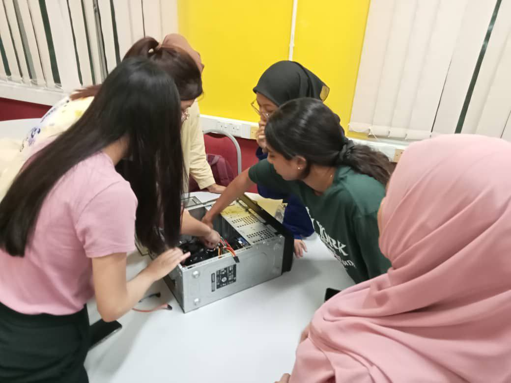
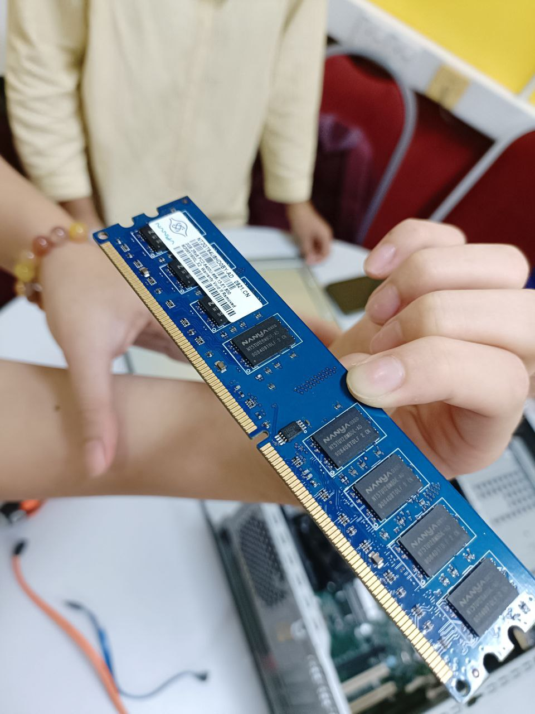
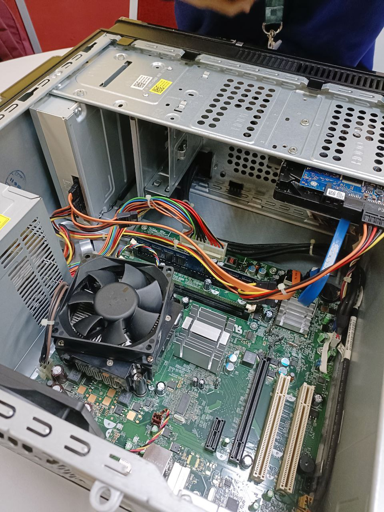

# Technology and Information System
This course will introduce students to information systems and technology (IS/IT) encompassing hardware, software, network and communications and its uses at home and work. Students will gain basic skills in handling PC installation and productivity tools. Industry visits and talks will be conducted to expose students to a real working environment and get knowledge from the industry. Students need to briefly explore the requirements and job specifications for a career in IT.

- [Course content](#course-content)
- [Assignments](#assignments)
- [Reflection](#reflection)

## Course Content
- Chapter 1: ICT
- Chapter 2: Hardware
- Chapter 3: Software
- Chapter 4: Information System and System Analysis Design
- Chapter 5: Databases & Data Analytics
- Chapter 6: Networks and Communication
- Chapter 7: Privacy, Security and Ethics
- Chapter 8: Cloud Computing

## Assignments 
### PC Assemble 

### Assignment 1: [Report on visiting NALI 2023](https://github.com/xr-lim/Technology-and-Information-System-SECP1513-/blob/main/Assignment%201.pdf)
- Students are required to identify 5 posters related to Information and Communication Technology (ICT) in teaching and learning and do interview sessions with the participants of NALI 2023.

### Assignment 2: [Poster on Industrial Talk 1](https://github.com/xr-lim/Technology-and-Information-System-SECP1513-/blob/main/Assignment%202.pdf)
- An industrial talk was held on 14th November 2023 by Clarity Tech Works Sdn Bhd to introduce the overview of ICT jobs. Students must create a poster with an executive summary, introduction, and content based on the issues discussed in the talk, and reflection.

### Assignment 3: [Video on Visit to UTMDigital and the Attended Virtual Talk](https://youtu.be/LHXL2e8UqG8?si=0JmyqLo3YTx3RYj6)
- Students are required to prepare a video that includes:

a.      Visit to UTMDigital

b.     The Virtual Talk on UTMDigital

### Assignment 4: [Report on Industrial Talk 2](https://github.com/xr-lim/Technology-and-Information-System-SECP1513-/blob/main/Assignment%204.pdf)
- An industrial talk was held on 3rd January 2024 by Credence (TM Subsidiary)  to introduce their organization's system development. A report is created including a description of the system development, history, technology, and tool use in Credence’s system development.

### Design Thinking Project 

## Reflection 

PC Assemble

During the PC assemble, I have learnt how to assemble and dissemble a PC. Also, I can recognize some part of the PC which every part is an important constitute to the feasibility of the computer. The activity was engaging too as a small competition was held to compete which group could assemble back the PC faster and the fastest group got the prize. I was so happy my group was the fastest of that session.

Assignment 1

Visiting NALI 2023 is a great opportunity for students to widen their horizons of the extent of ICT-related projects and ideas. Visiting such exhibitions also provides students with a clearer understanding of the application of Technology and Information systems in real life.

Assignment 2

I think the structure and organization of Clarity Techworks sparked my excitement to step into the ICT industry in the future. I love the positive vibes between co-workers and managers. The talk is also insightful as the employee of Clarity Techworks have introduced their role and position details in the organization including their routine, challenges, the tools they use in their work etc. Overall, it's an honor to attend this virtual talk as it inspired me to become more dedicated and motivated role in ICT in the future. 

Assignment 3

A visit to UTM Digital and attending the virtual talk has benefits the students to gain more knowledge regarding the infrastructure of IT and the built system in a successful and organized company. It was a pleasure to visit UTMDigital as it exposed the real environment of being a tech developer, manager, IT technician, etc. I think it's good to have the virtual talk before physically visiting the office as detailed explanations were briefed during the virtual talk and students are more inclined to explore the office during the visit. 

Assignment 4

A visit to UTM Digital and attending the virtual talk has benefits the students to gain more knowledge regarding the infrastructure of IT and the built system in a successful and organized company. It was a pleasure to visit UTMDigital as it exposed the real environment of being a tech developer, manager, IT technician, etc. I think it's good to have the virtual talk before physically visiting the office as detailed explanations were briefed during the virtual talk and students are more inclined to explore the office during the visit. 

Assignment 4

The talk was given by Ms Qistina, which were a UTM alumni and now working at Credence(TM subsidiary). The most impressive of her talks is the experience she shared with us during her uni life. She gave a lot of advice to university students like us. For instance, she mentioned that she faced a lot of challenges during her internship but due to her grit and determination, her superior saw potential in her and eventually offered a job for her in Credence. It's very inspirational to be such a dedicated and persevering person like her. Other than that, she also shared about the role of data analyst andit's importance which gave me an insight into the importance of data.

