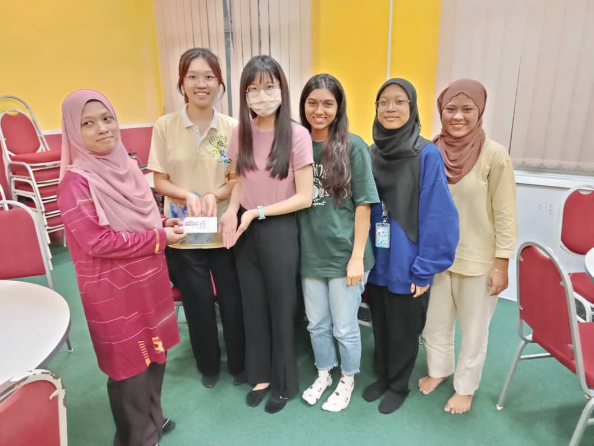

# Technology and Information System
This course will introduce students to information systems and technology (IS/IT) encompassing hardware, software, network and communications and its uses at home and work. Students will gain basic skills in handling PC installation and productivity tools. Industry visits and talks will be conducted to expose students to a real working environment and get knowledge from the industry. Students need to briefly explore the requirements and job specifications for a career in IT.

- [Course content](#course-content)
- [Assignments](#assignments)
- [Reflection](#reflection)

## Course Content
- Chapter 1: ICT
- Chapter 2: Hardware
- Chapter 3: Software
- Chapter 4: Information System and System Analysis Design
- Chapter 5: Databases & Data Analytics
- Chapter 6: Networks and Communication
- Chapter 7: Privacy, Security and Ethics
- Chapter 8: Cloud Computing

## Assignments 
### PC Assemble 

### Assignment 1: [Report on visiting NALI 2023](Assignment 1.pdf)
- 
